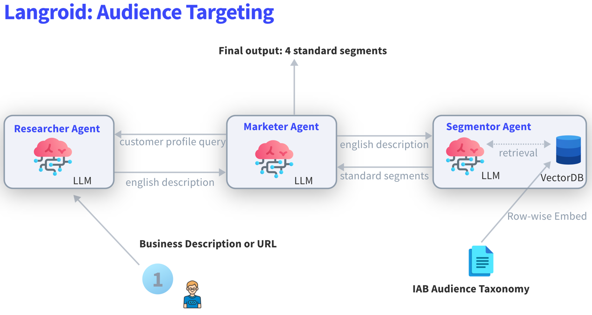

# Audience Targeting for a Business

Suppose you are a marketer for a business, trying to figure out which 
audience segments to target.
Your downstream systems require that you specify _standardized_ audience segments
to target, for example from the [IAB Audience Taxonomy](https://iabtechlab.com/standards/audience-taxonomy/).

There are thousands of standard audience segments, and normally you would need 
to search the list for potential segments that match what you think your ideal
customer profile is. This is a tedious, error-prone task.

But what if we can leverage an LLM such as GPT-4?
We know that GPT-4 has  skills that are ideally suited for this task:

- General knowledge about businesses and their ideal customers
- Ability to recognize which standard segments match an English description of a customer profile
- Ability to plan a conversation to get the information it needs to answer a question


Once you decide to use an LLM, you still need to figure out how to organize the 
various components of this task:

- **Research:** what are some ideal customer profiles for the business
- **Segmentation:** which standard segments match an English description of a customer profile
- **Planning:** how to organize the task to identify a few standard segments

## Using Langroid Agents 

Langroid makes it intuitive and simple to build an LLM-powered system organized
around agents, each responsible for a different task.
In less than a day we built a 3-agent system to automate this task:

- The `Marketer` Agent is given the Planning role
- The `Researcher` Agent is given the Research role
- The `Segmentor` Agent is given the Segmentation role

To kick off the system, the human user describes a business in English,
or provides the URL of the business's website. 
The `Marketer` Agent sends
customer profile queries to the `Researcher`, who answers in plain English based on 
the business description, and the Marketer takes this description and sends it to the Segmentor (who has
access to IAB Audience Segments, embedded into a vector-database), 
who maps it to standardized segments. The task is done when the Marketer finds 4 standardized segments. 
The agents are depicted in the diagram below:



## An example: Glashuette Watches

The human user first provides the URL of the business, in this case:
```text
https://www.jomashop.com/glashuette-watches.html
```
From this URL, the `Researcher` agent summarizes its understanding of the business.
The `Marketer` agent starts by asking the `Researcher`:
``` 
Could you please describe the age groups and interests of our typical customer?
```
The `Researcher` responds with an English description of the customer profile:
```text
Our typical customer is a fashion-conscious individual between 20 and 45 years...
```
The `Researcher` forwards this English description to the `Segmentor` agent, who
maps it to a standardized segment, e.g.:
```text
Interest|Style & Fashion|Fashion Trends
...
```
This conversation continues until the `Marketer` agent has identified 4 standardized segments.

Here is what the conversation looks like:


